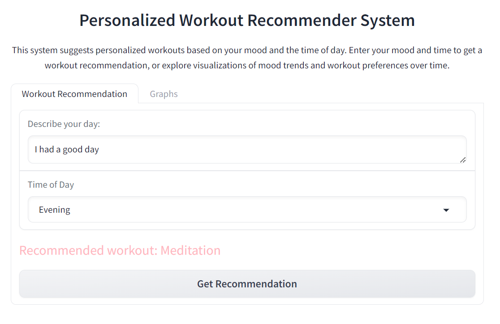
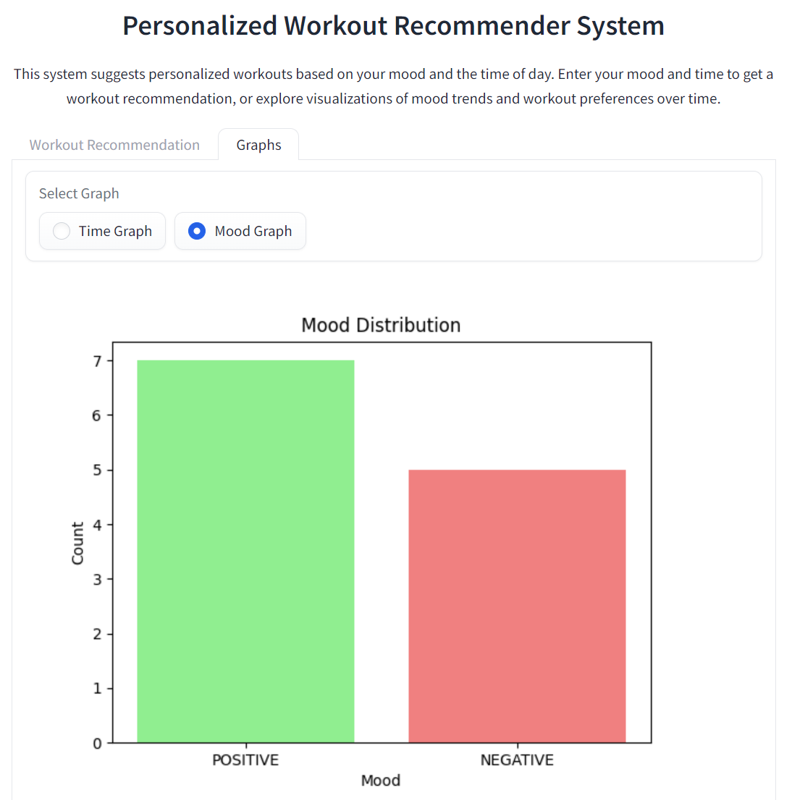
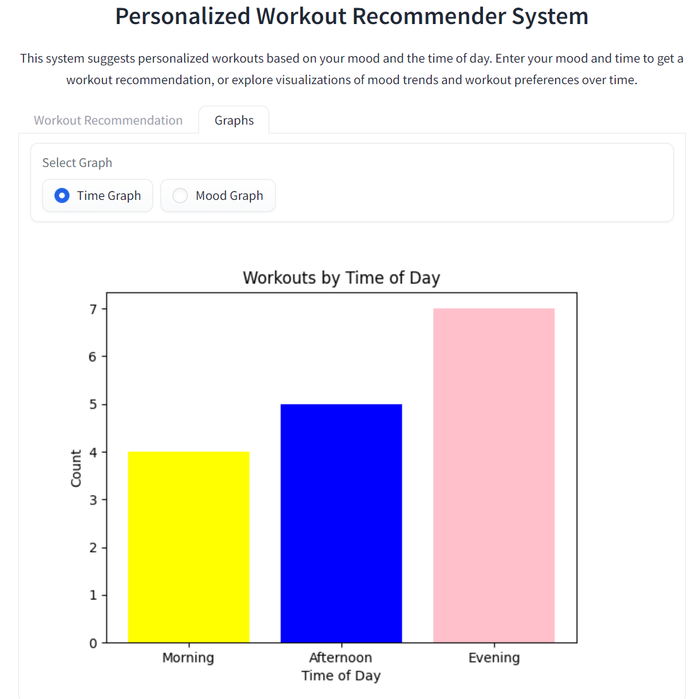

# personalized-Workout-Recommender

 A personalized workout recommender system is based on user input. Users describe their day and select a time of day (morning, afternoon, evening). Based on their mood and the time, the system suggests suitable workouts. The project uses Hugging Face’s sentiment analysis to classify the input text and a DataFrame to store possible workout suggestions.

# Files and Their Functions

1- Workout-Recommender-Application.ipynb:
- Mood Classifier: The black-forest-labs/FLUX.1-dev model is used to identify the user’s mood from their input. [Model]([https://pages.github.com/](https://huggingface.co/black-forest-labs/FLUX.1-dev))
- Gradio Interface: This interface allows users to enter their mood and select the time of day, and then it shows a workout suggestion based on this information.

2- Pipeline-file.ipynb:
- Focuses on using Hugging Face pipelines for mood classification and data management.

3- Gradio-file.ipynb: 
- Focuses on building the Gradio interface.

# Instructions to Run the Code
1- Prerequisites: Install the required dependencies:
- Gradio
- transformers
- pandas
- matplotlib
  
2- Running the Application: Execute the Python script. This will automatically open the Gradio interface in your web browser.
Using the Application: 
- Describe Your Day: Enter a description of your day into the provided text input field.
- Select the Time of Day: Choose the time from the available options (e.g., 'morning', 'afternoon', 'evening').

The application will:
- Classify Your Mood: Analyze your description to determine your mood.
- Display the Result: Show the mood classification and any related feedback.
- Generate a Graph: Create and display a graph based on the collected data.

# Expected Output

    
    

    
    

# Links
[Workout Recommender Space](https://huggingface.co/spaces/JanaAlbader/Personalized-Workout-Recommender) 
